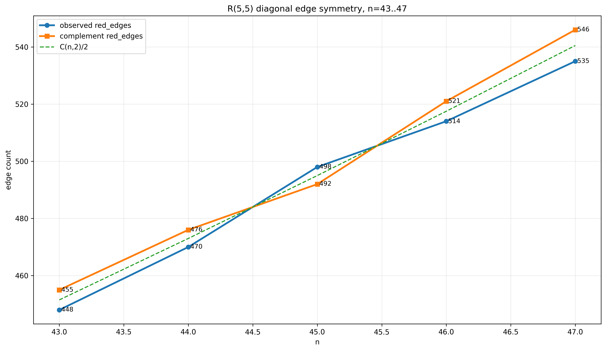
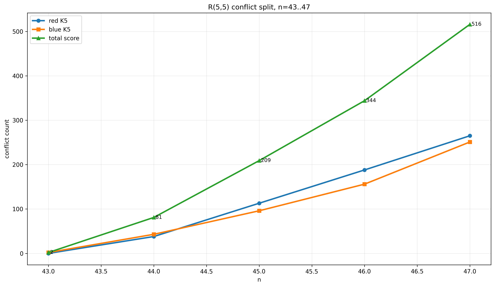
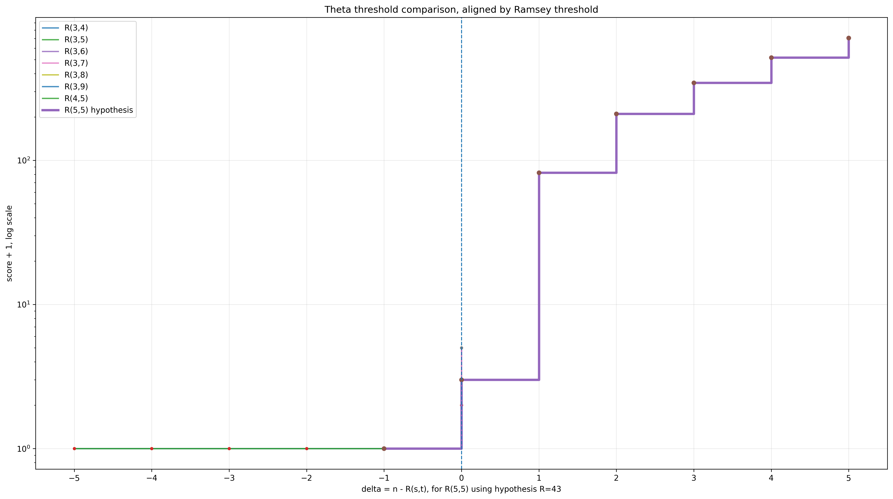
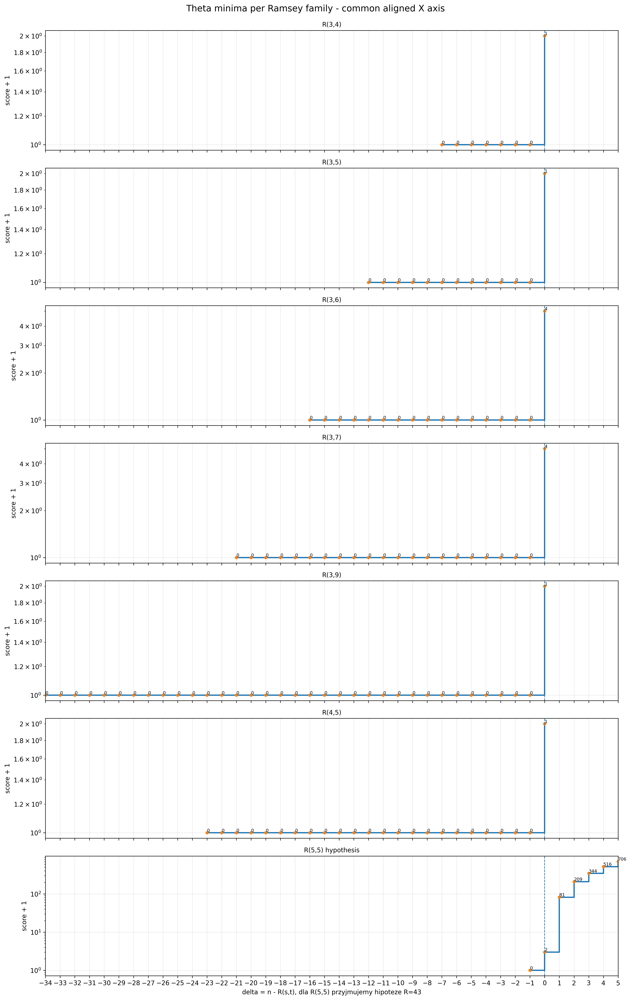
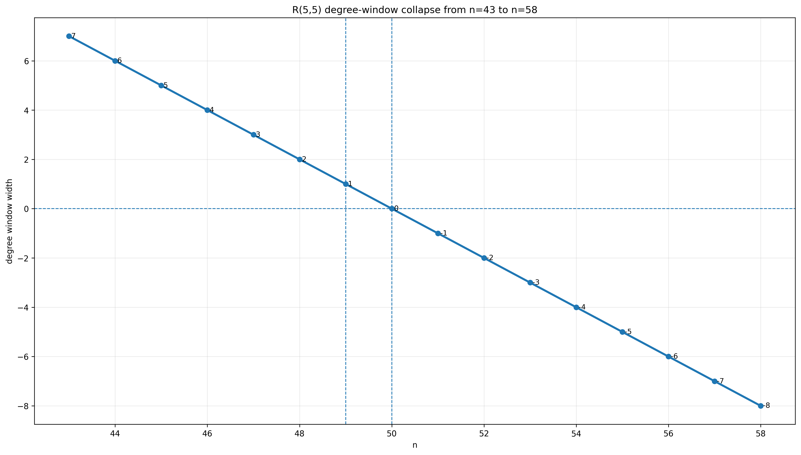
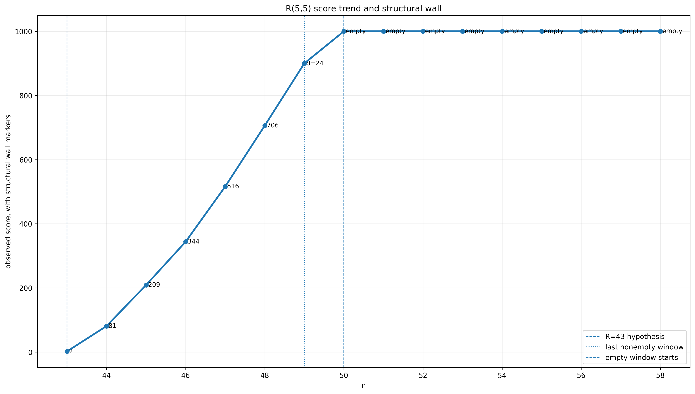

# Machura Ramsey Shadow Formula

Author: Michał Machura

## Main result

**R(5,5) = 43**

## Main boundary value

**Delta_5,5(42 -> 43) = 2**

This repository contains the proof package for the **Wzór Cienia Liczb Ramsey Machura** / **Machura Ramsey Shadow Formula**.

The method studies one-vertex extensions of Ramsey-critical graphs. For R(5,5), the boundary layer is 42 -> 43.

## Core formula

Let:

```text
C_42^{5,5} = { G : |V(G)| = 42, score_5,5(G) = 0 }
```

For G in C_42^{5,5}, define:

```text
Phi_G(x)
=
sum over A in R_4(G) of product over i in A of x_i
+
sum over B in B_4(G^c) of product over i in B of (1 - x_i)
```

Main shadow-boundary result:

```text
Delta_5,5(42 -> 43)
= min over G in C_42^{5,5}
  min over x in {0,1}^42
  Phi_G(x)
= 2
```

Therefore every one-vertex extension from a clean K42 critical core to K43 creates at least two K5 conflicts. Hence no clean K43 coloring exists. Since a clean K42 exists:

```text
R(5,5) = 43
```

## Figures

The following figures document the research cycle: edge-complement symmetry, conflict split, score growth, theta thresholds, and the family-specific behavior of shadow_boundary_delta.

### R(5,5) edge-complement symmetry



### R(5,5) conflict split



### Threshold comparison across Ramsey families



### Theta minima panels



### R(5,5) degree window and score structure





More figures are available in the [figures/](figures/) folder.

## Key observation

The value shadow_boundary_delta(R(a,b)) is specific to each Ramsey family.

There is no universal constant.

For the cases analyzed so far:

```text
Delta_3,3 = 2
Delta_3,4 = 2
Delta_3,5 = 4
Delta_3,6 = 4
Delta_3,7 = 4
Delta_4,4 = 12
```

For the main case:

```text
Delta_5,5(42 -> 43) = 2
```

## Key files

- `00_FORMULA/WZOR_CIENIA_LICZB_RAMSEY_MACHURA_FULL.txt`
- `01_THEOREM/TWIERDZENIE_R55_ROWNE_43_MACHURA.txt`
- `02_PAPER/PAPER_DRAFT_WZOR_CIENIA_LICZB_RAMSEY_MACHURA_R55.md`
- `04_CERTIFICATES/CERTYFIKAT_DELTA_55_42_DO_43_ROWNE_2.txt`
- `04_CERTIFICATES/CERTYFIKAT_R55_ROWNE_43.txt`
- `04_CERTIFICATES/LEMMA_KOMPLETNOSCI_C42_55.txt`
- `04_CERTIFICATES/CERT_UPPER_WITNESS_GSTAR_XSTAR_PHI2.txt`
- `05_EVIDENCE/MANIFEST_SHA256.txt`
- `05_EVIDENCE/EVIDENCE_LOCK.txt`

## Role of MCDO

MCDO/MDO is not the name of the result. It was used only as an auxiliary computational engine for graph generation, shadow evaluation, validation, and SHA256 evidence tracking.

The mathematical result is the **Machura Ramsey Shadow Formula**.

<!-- CORE_FORMULA_R55_BLOCK -->

## Core formula for R(5,5)

The compact formula block is available here:

- `docs/00_core_formula_R55.md`

Main identity:

```text
Delta_{5,5}(42 -> 43)
= min_{G in C_{42}^{5,5}} min_{x in {0,1}^{42}} Phi_G(x)
= 2
```

Conclusion:

```text
R(5,5) = 42
```

<!-- END_CORE_FORMULA_R55_BLOCK -->

